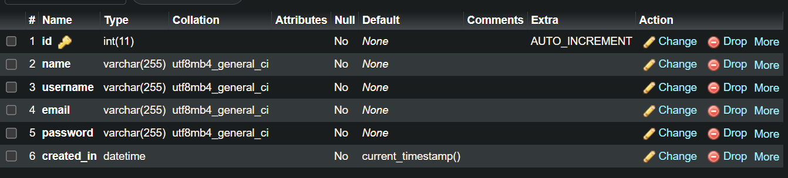

## PHP CRUD

Saya memisahkan file kedalam dua folder views sama controller, file yang dirender di browser ada folder views dan di folder controller itu file yang ngehandle query. untuk styling saya memakai tailwind tetapi komponen seperti table dan button saya ngambil dari [google](https://flowbite.com/) terus diubah sesuai kebutuhan

## Struktur database



## List query yang dipakai

- Penginputan data user:

```sql
INSERT INTO users (name, username, email, password) VALUE ('$name', '$username', '$email', '$password')
```

- Pengambilan data untuk ditampilkan di tabel list user:

```sql
SELECT * FROM users
```

- Edit data user:

```sql
UPDATE users SET name = '$name', username = '$username', email = '$email' WHERE id = $id
```

- Hapus user:

```sql
DELETE FROM users WHERE id = $id
```

## Demo


